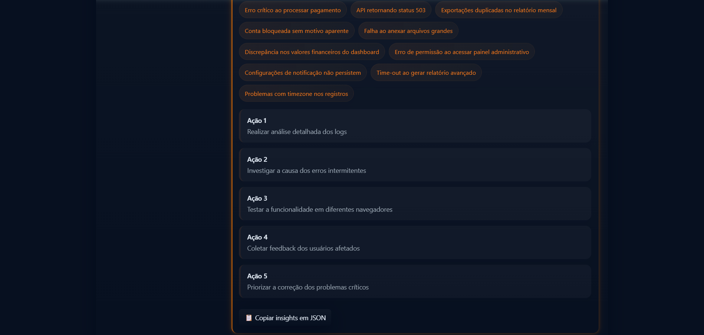

# 📬 InboxLogic — Respostas e Insights inteligentes com IA.

**Classificação, resposta automática e análise de grandes volumes de e-mails.**

> Projeto desenvolvido como solução para o *Case técnico da AutoU*. A aplicação utiliza IA para classificar e-mails, gerar respostas automáticas e extrair insights estruturados a partir de arquivos .txt, .pdf e .mbox.

---

## 📸 Demonstrações da Aplicação

### 🌙 Tema Escuro


### ☀️ Tema Claro


### 🧠 Módulo de Classificação


### 📊 Módulo de Análise e Insights




---

## 🎯 Objetivo do Projeto

Empresas que lidam com grande volume de e-mails precisam identificar rapidamente:

* mensagens produtivas que exigem ação;
* mensagens improdutivas que não precisam de resposta;
* padrões importantes em grandes lotes;
* respostas automáticas consistentes e claras.

A aplicação **InboxLogic** resolve esse problema combinando:

* **FastAPI**
* **Processamento de texto (PDF, TXT, MBOX)**
* **NLP**
* **IA (OpenAI GPT-4o-mini)**
* **Frontend moderno com Tailwind + tema dark/light**

---

## ✨ Principais Funcionalidades

### ✅ 1. Classificação & Resposta

* Classifica automaticamente um e-mail em **Produtivo**, **Improdutivo** ou **Neutro**.
* Gera uma resposta automática contextual.
* Suporta texto ou upload de arquivos.
* Exibe metadados avançados (debug opcionais).

### 📊 2. Análise & Insights

* Processa grandes volumes de e-mails.
* Gera automaticamente:

  * Resumo geral;
  * Temas principais;
  * Ações recomendadas.
* Permite copiar o JSON completo da análise.

### 📁 3. Suporte a Arquivos

* `.txt`
* `.pdf`
* `.mbox` (com extração de múltiplas mensagens)

### 🎨 4. UI Moderna

* Tema claro/escuro
* Drag & drop
* Layout responsivo
* Componentes visuais personalizados

---

## 🧱 Arquitetura do Projeto

```
AUTOU_CASE_TECNICO/
│
├── app/
│   ├── static/
│   │   └── index.html        # Frontend
│   ├── main.py               # API
│   └── nlp_utils.py          # NLP e IA
│
├── venv/
├── .env
├── requirements.txt
└── README.md
```

---

## 🚀 Tecnologias Utilizadas

**Backend**

* FastAPI
* Python 3.11+
* PyPDF2
* email parser (mbox)
* OpenAI GPT-4o-mini
* Heurística fallback

**Frontend**

* HTML + TailwindCSS
* JavaScript nativo
* Sistema avançado de tema Dark/Light

---

## 🧠 Fluxo da IA

### 🔍 1. Pré-processamento

* Normalize espaços e caracteres
* Quebra múltiplos e-mails por separador `---`

### 📨 2. Classificação

* JSON único (1 e-mail)
* JSON array (múltiplos)
* Fallback heurístico automático

### ✍️ 3. Resposta Automática

* Geração baseada na categoria do e-mail

### 📊 4. Análise

```
{
  "resumo": "...",
  "temas": ["..."],
  "acoes": ["..."]
}
```

---

## ⚙️ Instalação e Execução

### 1. Clonar o projeto

```bash
git clone https://github.com/danilooliveira-lab/inboxlogic
cd inboxlogic
```

### 2. Criar ambiente virtual

```bash
python -m venv venv
source venv/bin/activate - Para sistemas Linux/macOS
venv\Scripts\activate    - Para sistemas Windows
```

### 3. Instalar dependências

```bash
pip install -r requirements.txt
```

### 4. Configurar chave OpenAI

Criar o arquivo `.env`:

```
OPENAI_API_KEY="sua-chave-aqui"
```

### 5. Rodar servidor

```bash
uvicorn app.main:app --reload
```

Acesse:

```
http://localhost:8000
```

---

## 📡 Endpoints

### POST `/classify`

Retorno:

```
{
  "classificacao": { "label": "produtivo", "score": 0.91 },
  "resposta": "...",
  "meta": {...}
}
```

### POST `/analise`

Retorno:

```
{
  "analise": {
    "resumo": "...",
    "temas": [...],
    "acoes": [...]
  }
}
```


## 🛡️ Tratamento de Erros

* PDF inválido → fallback
* MBOX corrompido → fallback
* Falha da API → heurística
* JSON inválido → reparo automático
* Entrada vazia → erro 400 amigável

## 🌐 Deploy Online

👉 **Aplicação na Nuvem (Deploy):** [https://inboxlogic.onrender.com](https://inboxlogic.onrender.com)

---

## 👤 Autor

**Danilo Oliveira**

Desenvolvedor • Python
